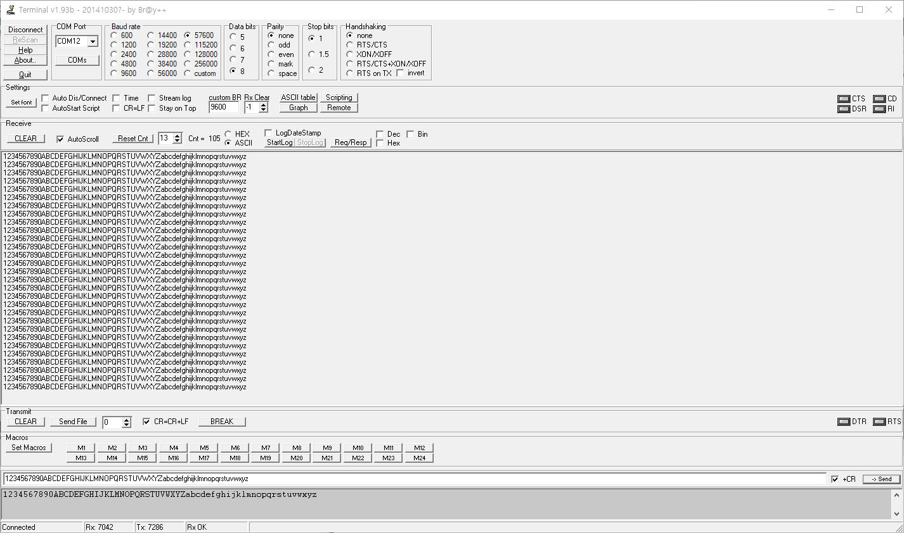

# AVR_SWUART
Software UART(Software Serial) library for AVR

[Tutorial] 
https://blog.naver.com/eziya76/221244587970 

I modified software UART sources written by danni. 
https://community.atmel.com/projects/second-uart-software

Modified two things for better understanding. 
1) Coding style (variable naming, macro, etc) 
2) Add more comments 

I tested this library on Atmega328p and it worked over baudrate 57600bps 

